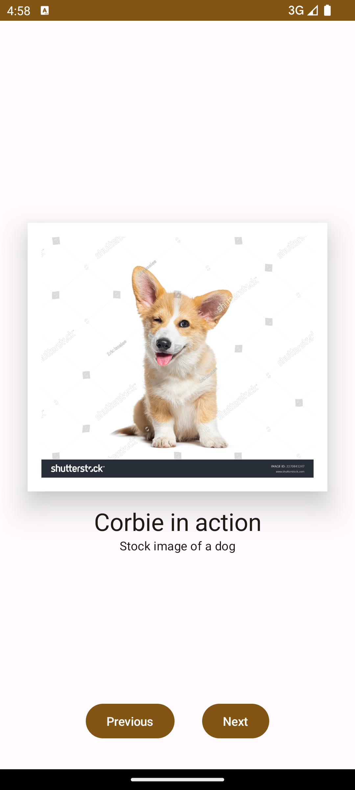

# Android Projects

## Info

This repository contains a collection of projects from the training course [Android Basics with Compose](https://developer.android.com/courses/android-basics-compose/course).

## Apps

| Project | Snapshot / Video capture | Notes |
| --- | --- | --- |
| Greeting Card | </img> | <ul><li>Simple project, uses `Box`, and `Column`.</li></ul> |
| Business Card | </img> | <ul><li>Custom views, mostly `Column`, and `Row` UI elements.</li></ul> |
| Dice Roller | </img> | <ul><li>Contains `by remember`.</li></ul> |
| Lemonade | </img> | <ul><li>Contains `by remember`.</li></ul> |
| Tip Calculator | </img> | <ul><li>UI elements such as `TextField`, `Row` or `Switch`.</li><li>UI tests with `composeRule`.</li><li>Has unit tests.</li><li>Contains `by remember`.</li><li>Tags `@StringRes` and `@DrawableRes`</ul> |
| Art Space | </img> | <ul><li>UI with `Card`, `Image`, `Row`, `Column`, and `Button` elements.</li></ul> |
| Affirmations | </img> | <ul><li>Has `Datasource` to load models in a `List`.</li><li>Uses `@StringRes` and `@DrawableRes` to display assets.</li><li>Implements `LazyColumn` and `Card` UI elements.</ul> |
| Courses | </img> | <ul><li>Has `Datasource` to load models in a `List`.</li><li>Uses `@StringRes` and `@DrawableRes` to display assets.</li><li>Implements `LazyVerticalGrid` and `Card` UI elements.</ul> |
| Woof | </img> | <ul><li>Views such as `LazyColumn`, `Card`, and `IconButton`.</li><li>Uses a custom theme with fonts and shapes.</li></ul> |
| Superheroes | </img> | <ul><li>Has views such as `CenterAlignedTopAppBar`, and `LazyColumn`.</li></ul> |
| Thirty Days | </img> | <ul><li>Contains `data class`.</li><li>UI elements such as `LazyColumn` and `CenterAlignedTopAppBar`.</li><li>Implements animations with `animateContentSize`.</li><li>Implements custom shapes and fonts.</li></ul> |
| Dessert Clicker | </img> | <ul><li>`ViewModel` implementation with `UIState`.</li><li>Models are loaded via `Datasource`.</li></ul> |
| Unscramble | </img> | <ul><li>UI elements such as `OutlinedTextField` and `OutlinedButton`.</li><li>Uses a `ViewModel` with `UIState`.</li><li>Has unit tests.</li></ul> |
| Cupcake | </img> | <ul><li>Implements navigation with `NavHostController`.</li><li>Has UI tests for navigation.</li><li>Implements `ViewModel` with `UIState`.</li></ul> |
| Reply | </img> | <ul><li>Supports multiple size and devices with size classes (`WindowWidthSizeClass`).</li><li>Has UI tests implemented.</li><li>Implements `ViewModel` with `UIState`.</li></ul> |
| Sports | </img> | <ul><li>Supports multiple size and devices with size classes (`WindowWidthSizeClass`).</li><li>Implements `ViewModel` with `UIState`.</li></ul> |
| Race Tracker | </img> | <ul><li>Implementation of coroutines.</li><li>Contains unit tests.</li></ul> |
| Mars Photos | </img> | <ul><li>Uses `viewModel.launchScope`.</li><li>First implementation of data and network layers.</li><li>Uses the Repository pattern.</li><li>The `ViewModel` is created via a factory `viewModelFactory`.</li></ul> |
| Amphibians | </img> | <ul><li>WIP</li></ul> |
